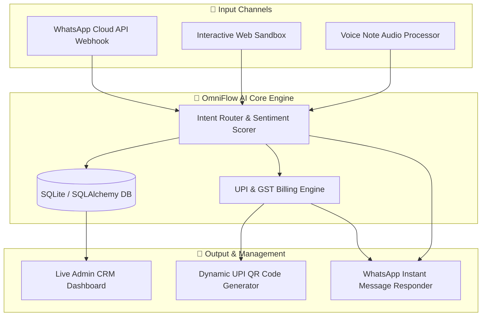

# OmniFlow AI 🚀
### *Autonomous Multimodal WhatsApp CRM & Instant UPI Billing Engine for Indian MSMEs*


---

## 📌 Executive Summary

**OmniFlow AI** is an end-to-end autonomous customer engagement and instant payment collection system designed for Indian MSMEs, coaching institutes, and e-commerce vendors. Operating directly over **WhatsApp + Web**, it converts raw customer text inquiries and voice notes into immediate sales conversions with automated GST invoices and dynamic UPI QR codes (GPay, PhonePe, Paytm, BHIM).

---

## 🌟 Key Features

- **🎙️ Multimodal & Multilingual Voice Note Engine:** Processes voice recordings and text messages in English, Hinglish, Hindi, and regional languages.
- **⚡ Instant NPCI-Compliant UPI QR & Link Generation:** Generates real-time custom UPI QR Code PNGs and deep links containing exact invoice amounts, customer names, and tax breakdowns.
- **🤖 Context-Aware AI Intent Router:** Dynamically handles course catalog inquiries, fee structures, payment verifications, address requests, and fallback routing.
- **📊 Real-Time Web Admin CRM Dashboard:** Dark-mode responsive web interface displaying lead status tracking, total revenue analytics, pending payment alerts, and an interactive WhatsApp sandbox simulator.
- **🔔 Automated Payment Verification & Reminders:** Automatically verifies customer payment messages, updates lead status to `CONVERTED`, and dispatches gentle payment reminders for unpaid invoices.

---

## 🏗️ System Architecture



---

## 🛠️ Tech Stack & Dependencies

| Component | Technology | Description |
| :--- | :--- | :--- |
| **Backend Framework** | `Python 3.10` / `FastAPI` | High-performance async REST API & Webhook handler |
| **Database & ORM** | `SQLite` / `SQLAlchemy` | Lightweight persistence for leads, chat history & invoices |
| **Billing & Payments** | `qrcode` / `Pillow` / `NPCI Spec` | Dynamic UPI URI generator & QR code renderer |
| **Frontend Dashboard** | `HTML5` / `Tailwind CSS` / `Alpine.js` | Responsive dark-mode CRM workspace & live simulator |
| **Voice Processing** | `VoiceAudioProcessor` | Transcribes and classifies speech audio intents |

---

## ⚡ Quickstart Guide

### 1. Clone & Install Dependencies
```bash
cd scratch/ai-whatsapp-crm
python -m venv venv
# On Windows:
venv\Scripts\activate
# On Mac/Linux:
source venv/bin/activate

pip install -r requirements.txt
```

### 2. Seed Database & Run Core Tests
```bash
python main.py
```

### 3. Launch OmniFlow AI Server & Dashboard
```bash
uvicorn app:app --reload --host 127.0.0.1 --port 8000
```

- 📊 **Live Web Dashboard:** [http://127.0.0.1:8000/dashboard](http://127.0.0.1:8000/dashboard)
- 💬 **Interactive Chat Sandbox:** [http://127.0.0.1:8000/sandbox](http://127.0.0.1:8000/sandbox)
- 📖 **OpenAPI Docs:** [http://127.0.0.1:8000/docs](http://127.0.0.1:8000/docs)

---

## 🎬 2-Minute Demo Video Walkthrough Script

1. **[0:00 - 0:25] The Problem:** Highlight how small business owners lose sales because answering payment/course queries on WhatsApp is manual and slow.
2. **[0:25 - 1:00] Live Chat Simulation:** Open `http://127.0.0.1:8000/dashboard`. Show typing *"Hi, what courses do you offer?"* and watch OmniFlow AI instantly reply with the full catalog.
3. **[1:00 - 1:35] Instant UPI QR Invoice:** Type *"Enroll in AI Python Masterclass"*. Show OmniFlow AI generating a complete GST Invoice text + real dynamic UPI QR image.
4. **[1:35 - 2:00] Real-Time CRM Dashboard:** Show the right panel updating the lead status to `INVOICED`, total revenue updating live, and payment confirmation handling!

---

## 🛡️ License & Team
Created for **Hack Devengers 2.0** by **Seetharam Ravula**. All rights reserved.
